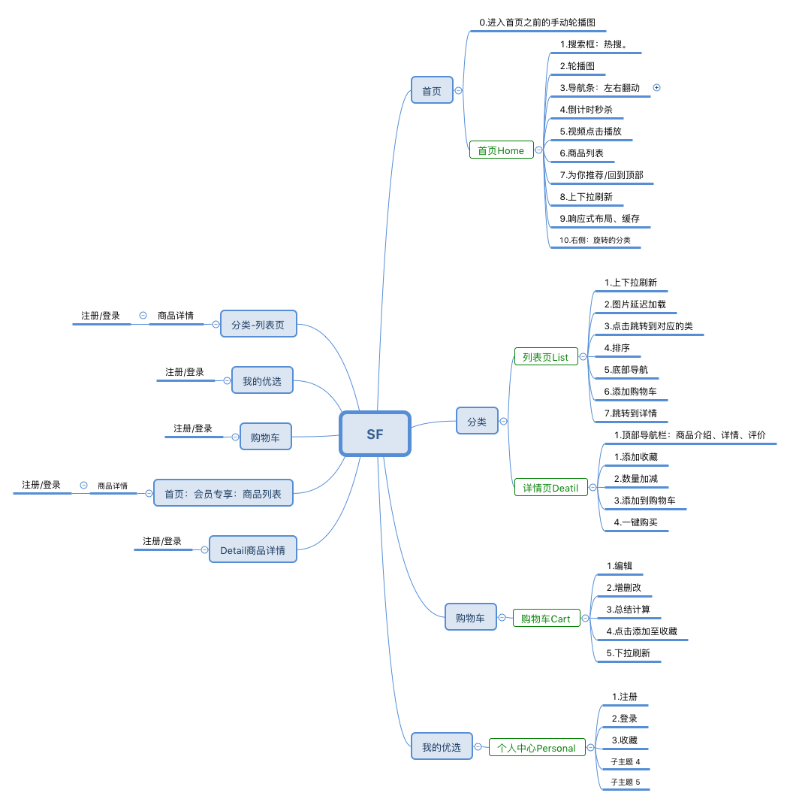

#顺丰优选项目说明文档


项目目录介绍:



├──src # 前端目录
│   ├── api
│   │   ├── 
│   │   ├──
│   │   ├──
│   │   ├── 
│   │   ├── 
│   │   └── 
│   ├── 
│   ├── component # 公用组件
│   │   ├── 
│   │   ├──
│   │   ├──
│   │   ├── 
│   │   ├── 
│   │   └── 
│   ├──containers # 容器组件
│   │   ├── 
│   │   ├──
│   │   ├──
│   │   ├── 
│   │   ├── 
│   │   └── 
│   ├── style # 公用样式
│   ├── store#仓库
│   │   ├── actions # redux action
│   │   └── reducer # redux reducer
│   ├── 
│   ├── index.html# HTML页面模板
│   └── util # 工具类库
├── 
├── dist # 编译后的目录
├── 
├── config # 配置文件
│   └── api
├── router 
├── static # 静态资源服务
│   └── img
│       └── 
└── 


####代码克隆：

git clone https://github.com/xiexiaoge/SF-preferred
启动项目：npm run dev


### 初始化项目
```
npm init -y
```
# 安装依赖的模块

## 后端依赖的模块
```
npm install body-parser connect-mongo ejs express express-session mongoose -S
```
## 前端依赖的模块  生产依赖
```
npm install es6-promise history react react-dom react-redux react-router-dom react-router-redux@next react-swipe react-transition-group redux redux-thunk swipe-js-iso whatwg-fetch -S
```
## 开发依赖模块 开发依赖
```
npm install babel-core babel-loader babel-preset-es2015 babel-preset-react babel-preset-stage-0 css-loader file-loader url-loader html-webpack-plugin less less-loader style-loader webpack webpack-dev-server html-webpack-plugin -D
```

###资源文件
写项目需要用到的图片，psd，数据js文件


